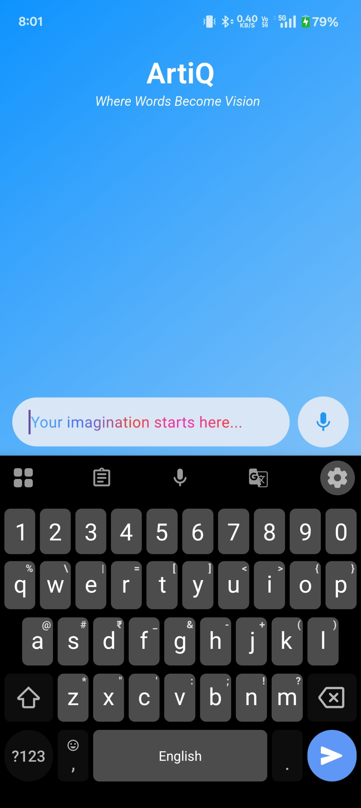
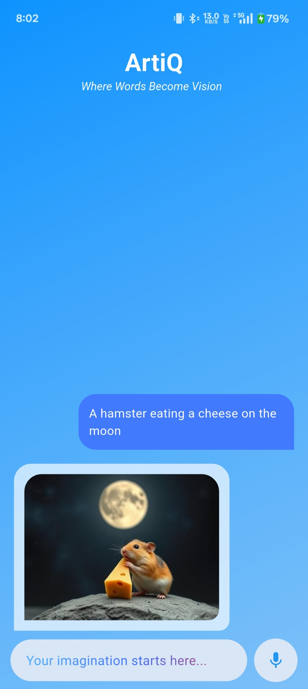

# AriQ - Image Generator App

**AriQ** is a Flutter app that allows users to generate images based on a text description. The app communicates with a Flask API to generate and display the image.

## Features

- Generate images from a text description
- Display the generated image in the app
- Handle network connectivity issues
- Provide loading indicators and error messages

## 📱 Screenshots

### 🏠 Home Screen



## 🎨 Usage
- Launch the app and input a description for the image you want to generate.
- Tap the "Generate Image" button.
- The app will send the description to the Flask API, and the generated image will be displayed.
- If successful, the image will appear. If there’s an error, an error message will be shown.

## ⚙️ App Structure
- ApiHandler.dart: Handles API requests and image decoding.
- ImageGeneratorScreen.dart: Displays the user interface for generating and displaying the image.
- main.dart: The entry point for the Flutter application.

## Acknowledgements
- Flask for powering the API.
- Flutter for building the app.

## 🧑‍💻 Getting Started

Clone the repo:

```bash
git clone https://github.com/Rxjpawar/AriQ.git
cd AriQ
flutter pub get
flutter run

